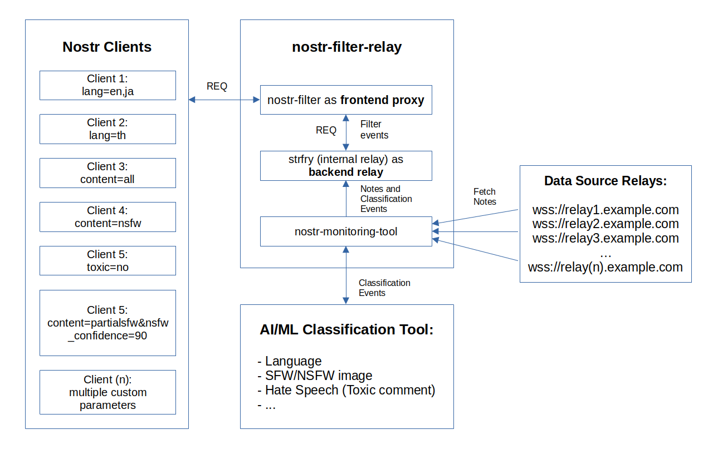

# nostr-filter-relay

A nostr relay docker image package which filter content based on content type (SFW/NSFW), user type, language, hate speech (toxic comment), and various rules.

This docker image consists of several software packages:

- [atrifat/nostr-filter](https://github.com/atrifat/nostr-filter) (customized/fork of [imksoo/nostr-filter](https://github.com/imksoo/nostr-filter)) as frontend filter relay
- [atrifat/nostr-monitoring-tool](https://github.com/atrifat/nostr-monitoring-tool) as content classification tool
- [hoytech/strfry](https://github.com/hoytech/strfry) as backend relay


## Demo

A public demo (beta/test) instance is available on [wss://nostr-id-relay.hf.space](wss://nostr-id-relay.hf.space). There is no guarantee for the uptime, but feel free to test.

## Usage

Check [USAGE.md](https://github.com/atrifat/nostr-filter-relay/blob/main/USAGE.md) document for instructions on how to use nostr-filter-relay as Nostr users.

## Features

A relay software package that filter note (kind: 1) contents in various category such as:

- [x] NSFW/SFW content detection
- [x] Language detection
- [x] User type filtering (Nostr user/non bridged user, activitypub bridged user)
- [x] Hate speech (Toxic comment) detection
- [ ] (WIP) Sentiment analysis
- [ ] (Planned) Topic classification
- [x] All other features included in [atrifat/nostr-filter](https://github.com/atrifat/nostr-filter) and [atrifat/nostr-monitoring-tool](https://github.com/atrifat/nostr-monitoring-tool)

## How it works



1. **nostr-filter-relay** is docker image that will run several softwares: [atrifat/nostr-monitoring-tool](https://github.com/atrifat/nostr-monitoring-tool), [atrifat/nostr-filter](https://github.com/atrifat/nostr-filter), and [hoytech/strfry](https://github.com/atrifat/nostr-filter) relay in launch script at startup.
2. **nostr-monitoring-tool** is classification tool that fetch and subscribe notes (kind: 1) from various relays. It will process every notes (extraction of image url, text preprocessing) that were seen and send them into external AI classification tool. Currently, it will send processed notes content into NSFW Detector API instance (using [atrifat/nsfw-detector-api](https://github.com/atrifat/nsfw-detector-api)), Language Detector API instance (using [atrifat/language-detector-api](https://github.com/atrifat/language-detector-api) or [LibreTranslate](https://github.com/LibreTranslate/LibreTranslate)), and Hate Speech Detector API instance (using [atrifat/hate-speech-detector-api](https://github.com/atrifat/hate-speech-detector-api)). All three API services will give classification results (SFW/NSFW classification, Language classfication, Toxic classification) that will be saved as **custom kind 9978** in local strfry relay that has already been running. Data format is shown in [atrifat/nostr-monitoring-tool](https://github.com/atrifat/nostr-monitoring-tool) repository.

   Basic Data flow:
   **Source Relays (notes) -> nostr-monitoring-tool (connect to external API for classification) -> local strfry**

3. Now, using **classification data (kind: 9978)** saved in local strfry relay, **atrifat/nostr-filter** will act as proxy relay and intercept any REQ from **nostr clients** and forward them into **local strfry relay**. **Local strfry relay** will respond as usual by giving events based on REQ data back to **nostr-filter**. Before sending events back to nostr clients, **nostr-filter** will check events from local strfry whether it has classification data (kind: 9978) or not. For example, users set nostr-filter-relay **parameters** to **only** gives notes which has **"English" language** then nostr-filter will only gives those notes based on **language classification data**. Any non "English" notes will be skipped.

   Basic Data flow:
   **Nostr clients <-> nostr-filter (act like frontend proxy) <-> local strfry**

4. Finally, **Nostr clients** will get filtered events (example: real data from strfry are 2000 notes but filtered into 1800 "english" notes) and show the notes to users.

## Requirements

The following softwares are required if you want to run your own nostr-filter-relay.

- Docker
- Personal instance of [atrifat/nsfw-detector-api](https://github.com/atrifat/nsfw-detector-api). Check [atrifat/nsfw-detector-api](https://github.com/atrifat/nsfw-detector-api) Github repository for more instructions.
- Personal instance of [atrifat/language-detector-api](https://github.com/atrifat/language-detector-api) or [LibreTranslate](https://github.com/LibreTranslate/LibreTranslate). Check [atrifat/language-detector-api](https://github.com/atrifat/language-detector-api) or [LibreTranslate](https://github.com/LibreTranslate/LibreTranslate) Github repository for more instructions.
- Personal instance of [atrifat/hate-speech-detector-api](https://github.com/atrifat/hate-speech-detector-api). Check [atrifat/hate-speech-detector-api](https://github.com/atrifat/hate-speech-detector-api) Github repository for more instructions.

## Getting Started

You can start by cloning this repository:

```
git clone https://github.com/atrifat/nostr-filter-relay
cd nostr-filter-relay
```

Before running nostr-filter-relay, make sure you have already configured your own personal instance of [atrifat/nsfw-detector-api](https://github.com/atrifat/nsfw-detector-api), [atrifat/language-detector-api](https://github.com/atrifat/language-detector-api) or [LibreTranslate](https://github.com/LibreTranslate/LibreTranslate), and [atrifat/hate-speech-detector-api](https://github.com/atrifat/hate-speech-detector-api). You don't have to run all of them only if you enable classification for certain task (Example: NSFW detection only).

Copy `.env.example` into `.env` file and change the configuration according to your own settings.

### Published Docker Image

If you don't want to build docker image locally, you can use the published version in [ghcr.io/atrifat/nostr-filter-relay](https://github.com/users/atrifat/packages/container/package/nostr-filter-relay).

Run it:

```
docker run --init --env-file .env -p 7860:7860 -it ghcr.io/atrifat/nostr-filter-relay:main
```

or run it in the background (daemon):

```
docker run --init --env-file .env -p 7860:7860 -it --name nostr-filter-relay -d ghcr.io/atrifat/nostr-filter-relay:main
```

### Build Docker Image Locally

Start building the docker image:

```
docker build -t nostr-filter-relay -f Dockerfile .
```

You can start running nostr-filter-relay

```
docker run --init --env-file .env -p 7860:7860 -it nostr-filter-relay
```

or run it in the background (daemon):

```
docker run --init --env-file .env -p 7860:7860 -it --name nostr-filter-relay -d nostr-filter-relay
```

## License

MIT License

Copyright (c) 2023 Rif'at Ahdi Ramadhani

Permission is hereby granted, free of charge, to any person obtaining a copy
of this software and associated documentation files (the "Software"), to deal
in the Software without restriction, including without limitation the rights
to use, copy, modify, merge, publish, distribute, sublicense, and/or sell
copies of the Software, and to permit persons to whom the Software is
furnished to do so, subject to the following conditions:

The above copyright notice and this permission notice shall be included in all
copies or substantial portions of the Software.

THE SOFTWARE IS PROVIDED "AS IS", WITHOUT WARRANTY OF ANY KIND, EXPRESS OR
IMPLIED, INCLUDING BUT NOT LIMITED TO THE WARRANTIES OF MERCHANTABILITY,
FITNESS FOR A PARTICULAR PURPOSE AND NONINFRINGEMENT. IN NO EVENT SHALL THE
AUTHORS OR COPYRIGHT HOLDERS BE LIABLE FOR ANY CLAIM, DAMAGES OR OTHER
LIABILITY, WHETHER IN AN ACTION OF CONTRACT, TORT OR OTHERWISE, ARISING FROM,
OUT OF OR IN CONNECTION WITH THE SOFTWARE OR THE USE OR OTHER DEALINGS IN THE
SOFTWARE.

## Author

Rif'at Ahdi Ramadhani (atrifat)

## Support

You can support this project by:

- ⭐ Starring the repo, reporting issue, and sending the pull requests.
- ⚡️ Sending some sats to my lightning address: [rifat@getalby.com](lightning:rifat@getalby.com)
